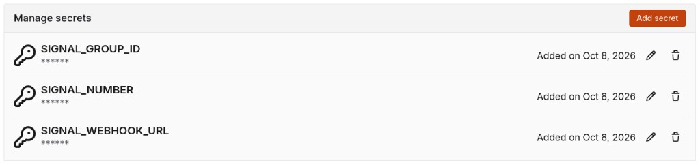

# Forgejo Signal notifications

After each [`.forgejo/workflows/container-build.yml`](.forgejo/workflows/container-build.yml) run completes, the workflow sends a message to a Signal group via the [signal-cli REST API](https://github.com/bbernhard/signal-cli-rest-api) (homelab instance documented in [podman-container-yaml README.signal-api.md](https://github.com/benblasco/podman-container-yaml/blob/main/README.signal-api.md)).

Notifications run on **success** and **failure**. A failed Signal API call does not fail the workflow (`continue-on-error: true` on both notify steps).

## Forgejo

- **Workflow:** [`.forgejo/workflows/container-build.yml`](.forgejo/workflows/container-build.yml) (`jq` + `curl` in the job container).
- **Runner label:** `fedora-server-bootc` (must reach the Signal API host, e.g. `micro.lan:9922`). Runner and job image setup: [README.forgejo-actions.md](README.forgejo-actions.md).

## Repository secrets

Add three secrets under the Forgejo repository → **Settings → Secrets → Add secret**. Names must match exactly what the workflow uses in `${{ secrets.* }}`.

Use the **same secret values** as Jenkins global credentials ([README.jenkins-notification.md](README.jenkins-notification.md)).

| Secret name | Jenkins credential ID | Secret |
|-------------|------------------------|--------|
| `SIGNAL_NUMBER` | `signal_number` | E.164 sender linked to the signal-cli API |
| `SIGNAL_GROUP_ID` | `signal_group_id` | `group.…` string |
| `SIGNAL_WEBHOOK_URL` | `signal_webhook_url` | e.g. `http://micro.lan:9922/v2/send` |

To find the group ID, see [backups-personal Signal notifications](https://github.com/benblasco/backups-personal/blob/main/README.signal-notifications.md) and [podman Signal API](https://github.com/benblasco/podman-container-yaml/blob/main/README.signal-api.md).



## Payload

Same JSON as backup notifications in [backups-personal](https://github.com/benblasco/backups-personal/blob/main/README.signal-notifications.md):

```json
{"message":"…","number":"+…","recipients":["group.…"]}
```

Example message: `FORGEJO owner/fedora-server-bootc #42: success | branch=main | fedora-server-bootc:main (20260929) | size=1.5GiB`.

### Image size (`size=`)

On success, the workflow appends `size=…` (IEC binary, e.g. `1.5GiB`). The value is the **sum of compressed layer sizes** from `skopeo inspect` on the image at **`nuc.lan:5000`** after push — the same metric as registry pull/push blob size. It is **not** the larger figure shown by `podman images` (uncompressed virtual size). See the **Record compressed registry image size** step in `.forgejo/workflows/container-build.yml`.

## Manual test

```bash
jq -n \
  --arg msg "forgejo-test: success" \
  --arg num "+YOUR_NUMBER" \
  --arg rid "YOUR_GROUP_ID" \
  '{message: $msg, number: $num, recipients: [$rid]}' \
| curl -sf -X POST "http://micro.lan:9922/v2/send" \
    -H "Content-Type: application/json" \
    -d @-
```

## Verify

- Trigger a workflow run; confirm the message in the Signal group (including `size=` on success).
- In the job log, **Record compressed registry image size** should log `Registry image docker://nuc.lan:5000/… compressed size: …`.
- Notify steps use `curl -sf` with no verbose logging on success.
