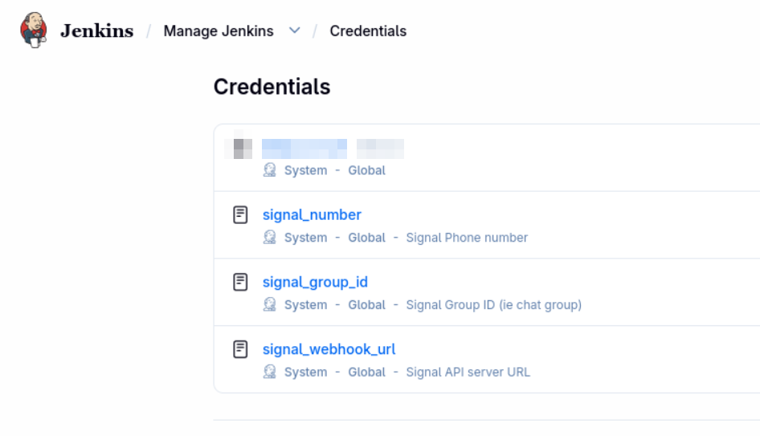

# Jenkins Signal notifications

After each `Jenkinsfile.container` run completes, the pipeline sends a message to a Signal group via the [signal-cli REST API](https://github.com/bbernhard/signal-cli-rest-api) (homelab instance documented in [podman-container-yaml README.signal-api.md](https://github.com/benblasco/podman-container-yaml/blob/main/README.signal-api.md)).

Notifications run on **success** and **failure**. A failed Signal API call does not change the build result.

## Jenkins

- **Plugin:** [HTTP Request](https://plugins.jenkins.io/http_request/) (`httpRequest` step).
- **Agent label:** `fedora-server-bootc` (must reach the Signal API host, e.g. `micro.lan:9922`).

## Jenkins credentials

Add three **Secret text** credentials under **Manage Jenkins → Credentials → System → Global credentials (unrestricted) → Add Credentials**. Use **Scope: Global** so any job (including `Jenkinsfile.container`) can resolve them.

The **ID** must match exactly what the pipeline uses in `withCredentials`; the Description is only for you in the UI.

| ID | Description (example) | Secret |
|----|------------------------|--------|
| `signal_number` | Signal Phone number | E.164 sender linked to the signal-cli API |
| `signal_group_id` | Signal Group ID (ie chat group) | `group.…` string |
| `signal_webhook_url` | Signal API server URL | e.g. `http://micro.lan:9922/v2/send` |

To find the group ID, see [backups-personal Signal notifications](https://github.com/benblasco/backups-personal/blob/main/README.signal-notifications.md) and [podman Signal API](https://github.com/benblasco/podman-container-yaml/blob/main/README.signal-api.md).



## Payload

Same JSON as backup notifications in [backups-personal](https://github.com/benblasco/backups-personal/blob/main/README.signal-notifications.md):

```json
{"message":"…","number":"+…","recipients":["group.…"]}
```

Example message: `fedora-server-bootc #42: success | branch=main | fedora-server-bootc:main (20260929)`.

## Manual test

```bash
jq -n \
  --arg msg "jenkins-test: success" \
  --arg num "+YOUR_NUMBER" \
  --arg rid "YOUR_GROUP_ID" \
  '{message: $msg, number: $num, recipients: [$rid]}' \
| curl -sf -X POST "http://micro.lan:9922/v2/send" \
    -H "Content-Type: application/json" \
    -d @-
```

## Verify

- Trigger a build; confirm the message in the Signal group.
- In the build log, the `httpRequest` step should run with `quiet: true` (no request body in the console).
